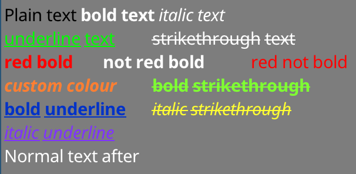

SDL STB Font Renderer
=====================
A header-only library for rendering text in pure [SDL2](https://www.libsdl.org/) with [STB_Truetype](https://github.com/nothings/stb). This caches glyphs as they are drawn allowing for fast text rendering. It also provides a couple of easy ways to render a string to texture for even faster text rendering.

New (2021)! Can also render in [bgfx](https://github.com/bkaradzic/bgfx) with `bgfxFrontend.h`!

## Example Image:


Sample text from http://www.columbia.edu/~fdc/utf8/index.html



## Contact:
Liam Twigger - @SnapperTheTwig

## Features:
* Single header library - no build system required. Just include and go!
* Runs in pure SDL - no OpenGL required (though it does work with OpenGL) 
* Simple text rendering - `fc.drawText(x, y, string)`
* Rendering to a texture - `fc.renderTextToTexture(string, &widthOut, &heightOut)`
* Formated text (if you have the fonts!). See the formatting section near the end
* Rendering to a texture object - see examples
* Can convert mouse location to caret location in string (strings without newlines only)
* UTF-8 support
* Handles newlines and tabs
* Fallback fonts support - can support many languages at once!
* Only ~1000 lines of code
* No dependencies apart from STB_Truetype, SDL and standard libraries
* Automatic or manual memory management
* Can support other frontends (such as DirectX/OpenGl/Vulkan/whatever apple is shoving down our throats) by extending some classes
* Public Domain

## Performance:
On a Intel i7-8750H:

Example image takes 0.7ms to render (~1400 FPS) if using texture (`renderTextToTexture`/`renderTextToObject`). The speed will be the maximum that SDL2 lets you flip a texture at.

Example image takes ~5ms to render (~200 FPS) if rendering directly (`drawText`)

For text that lasts more than one frame you should cache it with either `renderTextToTexture` or `renderTextToObject`.


How Do I?
=========

* [Use This Library?](#use-this-library)
* [Load Fonts and Draw Text?](#load-fonts-and-draw-text)
* [Get Font Metrics](#get-font-metrics)
* [Use Fallback Fonts (For Multilinugal Support)](#use-fallback-fonts-for-multilinugal-support)
* [Get the Size of Text](#get-the-size-of-text)
* [Manage Memory](#manage-memory)
* [Caching Results in a Texture](#caching-results-in-a-texture)
* [Print in Colours Other Than White](#print-in-colours-other-than-white)
* [Get Where in a String a User has Clicked](#get-where-in-a-string-a-user-has-clicked)
* [Handle Tabs](#handle-tabs)
* [Pregenerate Glyphs](#pregenerate-glyphs)
* [Write A Custom Frontend](#write-a-custom-backend)

Formatted Text:
* [Print Formatted Text?](#print-formatted-text)
* [Load Bold/Italic Font Variants?](#load-bold-italic_font-variants)
* [Limitations](#limitations)

Non-SDL Frontends:
* [BGFX](#BGFX)


## Use This Library?
This is a header only library - no build system required

In any header:
```c++
#include "path/to/sdlStbFont/sdlStbFont.h"
```

In *ONE* .cpp:
```c++
#define SDL_STB_FONT_IMPL
#include "path/to/sdlStbFont/sdlStbFont.h"
```

This library has a dependency on [STB_Truetype](https://github.com/nothings/stb). It will automatically include this. If you do not want it automatically included, use `#define STB_TRUETYPE_INCLUDE_HANDLED`, and handle the including of stb_truetype.h yourself. 

## Load Fonts and Draw Text?
```c++
#define SDL_STB_FONT_IMPL
#include "sdlStbFont.h"

...

// Load font
char * ttfFontFromMemory = loadFontFileSomehow("path/to/file.ttf");

sdl_stb_font_cache fc;
fc.faceSize = 24; // Must be set before loadFont()!
fc.tabWidthInSpaces = 8; // Optional
fc.loadFont(ttfFontFromMemory);

...

// Setup renderer
SDL_Renderer * mSdlRenderer = SDL_CreateRenderer(mWindow, SDL_RENDERER_SOFTWARE, 0);
fc.bindRenderer(mSdlRenderer); // Must bind a renderer before generating any glyphs

...

// Main loop
SDL_SetRenderDrawColor(mSdlRenderer, 125, 125, 125, 255);
SDL_RenderClear(mSdlRenderer);
fc.drawText(5, 5, "Hello world!");
SDL_RenderPresent(mSdlRenderer);

// fc will clean itself up when it falls out of scope
delete[] ttfFontFromMemory; // You must manually remove the char buff when done
// if you want auto management use fc.loadFontManaged(), which will transfer
// ownership of ttfFontFromMemory to fc and be freed when done.
```

You can also get the width and height of a rendered string:
```
fc.drawText(5, 5, widthOut, heightOut, "Hello world!");
// Draws "hello world" and sets widthOut and heightOut to the size of the string
```


## Get Font Metrics
 
```c++
class sdl_stb_font_cache {
...
public:
  int ascent;
  int descent;
  int lineGap;
  int baseline;
  int rowSize;
  int tabWidth;  // May be changed later
  float scale;
  float underlineThickness;
  float strikethroughThickness;
  float underlinePosition;
  float strikethroughPosition;
  // Must be set before loadFont() is called. Cannot be changed after
  int faceSize;      // Default is 20. All the parameters are calcualted based on this
  int tabWidthInSpaces;  // Default is 8, set this before loadFont(). Max 128. Sets tabWidth when font is loaded
...
  }
  
```

## Use Fallback Fonts (For Multilinugal Support)

```c++

fc.loadFont(ttfFontFromMemory);
fc.addFont(someSecondFontFromMemory);
fc.addFont(someThirdFontFromMemory);
...
etc

```

First font loaded must be with "loadFont".

Note that all fonts have to be loaded before any drawing functions are called. If a glyph is not found in the first font then the second font will be searched, etc.

## Get the Size of Text
```c++
int w, h;
fc.getTextSize(w, h, "Text");

h = fc.getTextHeight("Text"); // Faster, if only height is needed
int nRows = fc.getTextRows("Text \n More text"); // Returns the number of rows of text - here it's 2
```

Tip: `drawText()` returns the x coordinate of the end of a drawn string or formatted text object.

## Manage Memory

Manual Management:
```c++
char * mFontData = loadFontFromFileSomehow("path/to/file.ttf");
fc.loadFont(mFontData);
// You will have to free mFontData when you are done with it
// fc does not copy mFontData internally
// using fc after free'ing mFontData will result in undefined behaviour
```


Automatic Management:
```c++
filep * file = openFile("path/to/file");
sttfont_memory mFontData;
mFontData.alloc(file_size);
fread(file, &mFontData.data);
fc.loadFontManaged(mFontData);
// fc now owns mFontData's contents and will free it when fc is destroyed
// You can safely let mFontData fall out of scope
// Also addFontManaged is avaliable for adding fallback fonts
```


## Caching Results in a Texture
First way:
```c++
// creating
int RTw, RTh;
SDL_Texture * RT;
RT = fc.renderTextToTexture ("Text ", &RTw, &RTh);

// Rendering
SDL_Rect r;
r.x = 5;
r.y = 5;
r.w = RTw;
r.h = RTh;
SDL_RenderCopy(mSdlRenderer , RT , NULL, &r); 
```

Second way (same effect, but cleaner)
```c++
// creating
sdl_stb_prerendered_text prt;
prt.mRenderer = your__SDL_Render__instance;
fc.renderTextToObject(&prt, "Text"); 
		
// Rendering
prt.draw(x, y);

// Rendering in colour & alpha
prt.drawWithColor(x, y, 255, 185, 85, 255);

// Cleanup
prt.freeTexture();
```

Tip: `prt.draw()` returns the x coordinate of the end of the object.


## Print in Colours Other Than White
Use `SDL_SetTextureColorMod` with a cached texture. Or use `sdl_stb_prerendered_text::drawWithColor`.

## Get Where in a String a User has Clicked 
Use `getCaretPos(text, relativeMouseX, relativeMouseY)`

Note that this only currently supports carret lookup in strings without newlines - if you attempt this with a multiline string then it may return an incorrect value. 

## Handle Tabs
Tab width is handled by the variable `fc.tabWidth`. Characters after a tab will align to the next tab location.

You can set `fc.tabWidthInSpaces = X` before calling `fc.loadFont(...)` to automatically set `fc.tabWidth` to some multiple of the space width. By default fonts are set to 8 spaces in width. Lower values are better for monospace fonts, higher values are better for non-monospace fonts.

## Write A Custom Frontend
This library consists of two parts - a font handling backend (classes named `sttfont_*`) and a SDL rendering frontend (`sdl_stb_*`).

To make your own rendering frontend extend the relevent `sttfont_*` classes. See the SDL implementation for details. Its ~200 lines of code, all you have to do is take out the SDL specific stuff and put in your renderer specific stuff. In your application, include `sttFont.h` instead of `sdlStbFont.h`


## Pregenerate Glyphs
You can use the `pregenGlyphs function`:
```c++
std::vector<sttfont_uint32_t_range> codepoint_ranges;
sttfont_uint32_t_range customRange;
customRange.start = 1337; customRange.end = 1444; // end is inclusive

sttfont_uint32_t_range::populateRangesLatin(codepoint_ranges); // add the Latin character set
sttfont_uint32_t_range::populateRangesCyrillic(codepoint_ranges); // add the Cyrillic character set
fc.pregenGlyphs(codepoint_ranges, 0); // generatess the glyps
```

If you are software rendering in SDL *this is not needed*, and will just slow down startup. If you are using a custom frontend that uses texture atlases (such as bgfx) then this is recommended.


Formatted Text
==============

## Print Formatted Text?


First create a `sttfont_formatted_text`. The above example was created with:
```
sttfont_formatted_text formattedText;
formattedText << sttfont_format::black << "Plain text "
<< sttfont_format::bold << "bold text "
<< sttfont_format::italic << "italic text\n"
<< sttfont_format::underline << sttfont_format::green << "underline text\t"
<< sttfont_format::strikethrough << "strikethrough text\n"
<< sttfont_format::red << sttfont_format::bold << "red bold\t"
<< sttfont_format::bold << "not red bold\t"
<< sttfont_format::red << "red not bold\n"
<< sttfont_format::bold << sttfont_format::italic		<< sttfont_format::colour(255,127, 50) << "custom colour\t"
<< sttfont_format::bold << sttfont_format::strikethrough	<< sttfont_format::colour(127,255, 50) << "bold strikethrough\n"
<< sttfont_format::bold << sttfont_format::underline		<< sttfont_format::colour(  0, 50,200) << "bold underline\t"
<< sttfont_format::italic << sttfont_format::strikethrough	<< sttfont_format::colour(255,255, 50) << "italic strikethrough\n"
<< sttfont_format::italic << sttfont_format::underline		<< sttfont_format::colour(127, 50,255) << "italic underline"
```
You can combine formatting options with the `<<` operator. Formatting is reset after a string is inserted.

Then you can render using the same functions used for simple strings (`drawText(x, y, formattedText)`, etc). That includes rendering to texture with `renderTextToObject`.
Everything that you can do with a simple string you should be able to do with the same-named function (`getTextSize`, `getNumRows`, `getCaretPos`, etc)

## Load Bold/Italic Font Variants?
For Bold/Italic variants to work you must load a Bold/Italic variant of the font. For Bold+Italic you must load a Bold+Italic variant of the font! Underlines and Strikethroughs are generated automatically by this library.

To load a variant use `addFormatFont` or `addFormatFontManaged` after loading a base font. This also should be done for fallback fonts (for multilingual support) if you care about those fonts being availiable in bold/italic.

```
fc.loadFontManaged(notoSans);	// First font - loadFont
	fc.addFormatFontManaged(sttfont_format::FORMAT_BOLD, notoSansBold);
	fc.addFormatFontManaged(sttfont_format::FORMAT_ITALIC, notoSansItalic);
	fc.addFormatFontManaged(sttfont_format::FORMAT_BOLD | sttfont_format::FORMAT_ITALIC, notoSansBoldItalic);
fc.addFontManaged(notoSansArmenian);	// Fallback fonts - addFont
	fc.addFormatFontManaged(sttfont_format::FORMAT_BOLD, notoSansArmenianBold);
	fc.addFormatFontManaged(sttfont_format::FORMAT_ITALIC, notoSansArmenianItalic);
	fc.addFormatFontManaged(sttfont_format::FORMAT_BOLD | sttfont_format::FORMAT_ITALIC, notoSansArmenianBoldItalic);
```

## Limitations
If you request a Bold or Italic string and there isn't a Bold or Italic variant availiable the regular variant will be used. If you request a Bold+Italic string and there is only one loaded (but not the combination) the last loaded variant will be used - so if you request Bold+Italic and you have loaded Bold then Italic (but not Bold+Italic) then Italic will be rendered.

The library will draw Underline and Strikethrough variants itself, you do not need to provide these.

Non-SDL Frontends
=================

## BGFX
Include `bgfxFrontend.h` and create an instance of `bgfx_stb_font_cache`.

See `bgfxExample.cpp` to see how to use this frontend.

Some notes:
* If you are prerendering text, be aware that `renderTextToTexture/renderTextToObject` calls `bgfx::frame()`. You should call `renderTextTo*` between frames.
* The bgfx frontend uses texture atlases. It may be beneficial to call `sttfont_uint32_t_range::populateRangesLatin()` and similar to populate the atlas before rendering. If an atlas is filled with glyphs then the frontend will create a new atlas page.
 


Contributing
============
Be sure to create/edit the `.lzz` files, not the generated `.h` files. The tools + scripts to create the header files from the `.lzz` sources are provided.

Thanks
======
Thanks to the contribitors to both the SDL and STB projects!

License
=======
Public Domain

stb_truetype is Public Domain

Noto Fonts are (C) Google and are released under the SIL Open Font License, Version 1.1. See https://www.google.com/get/noto/

